# High concavity analysis 

## Concave D at 193

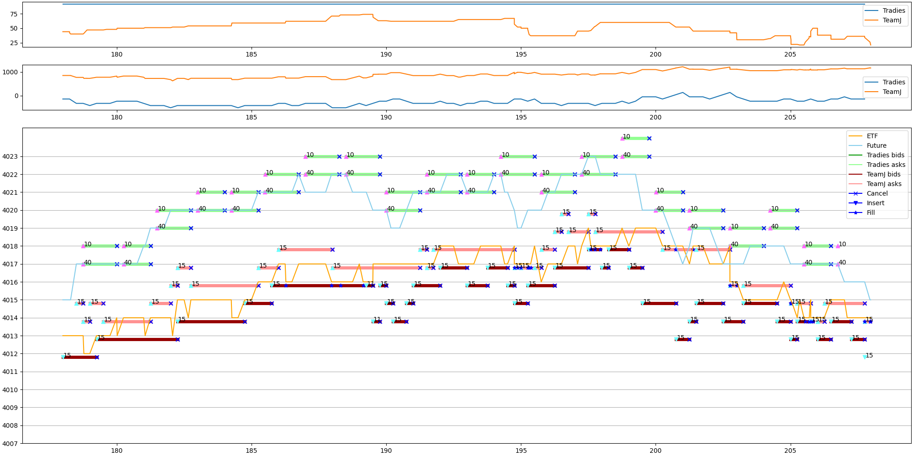

## Concave D at 297

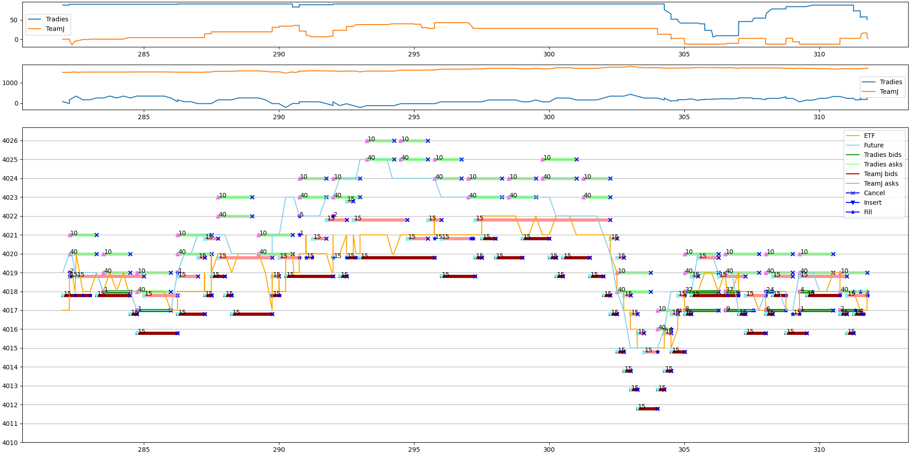

## Concave D at 387

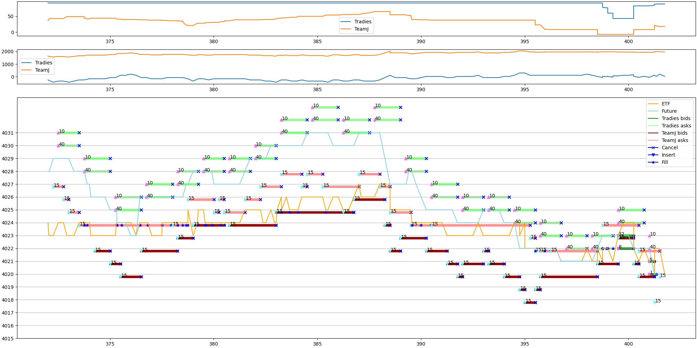

## Concave D at 770

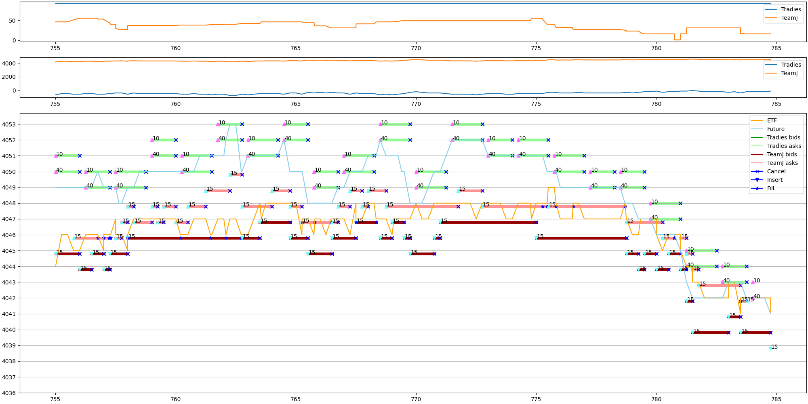

## Concave D at 1659

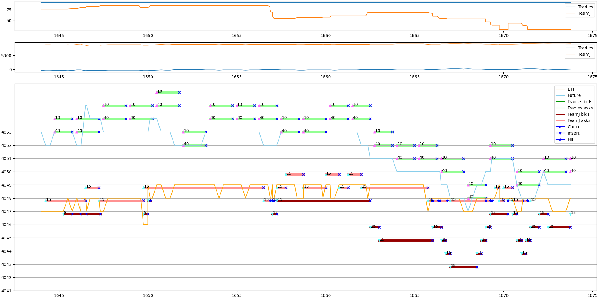

## Concave D at 2027

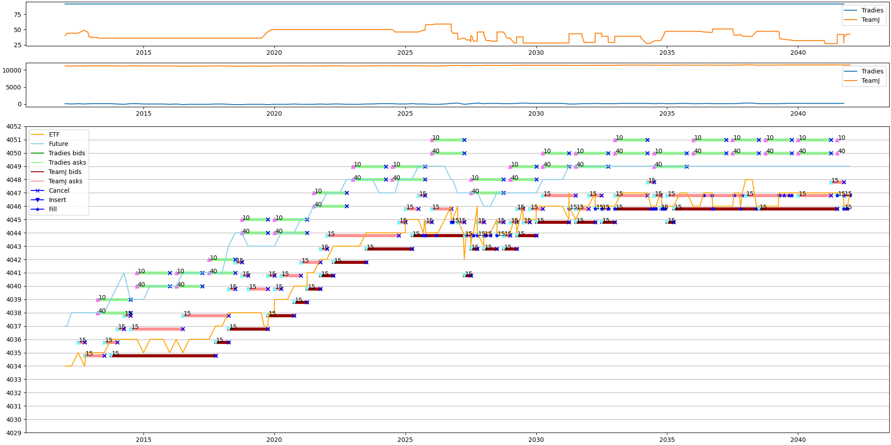

## Concave D at 2117

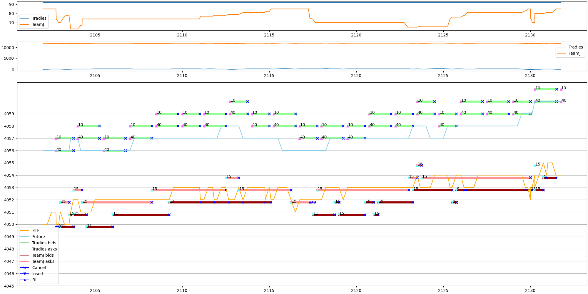

## Concave U at 253

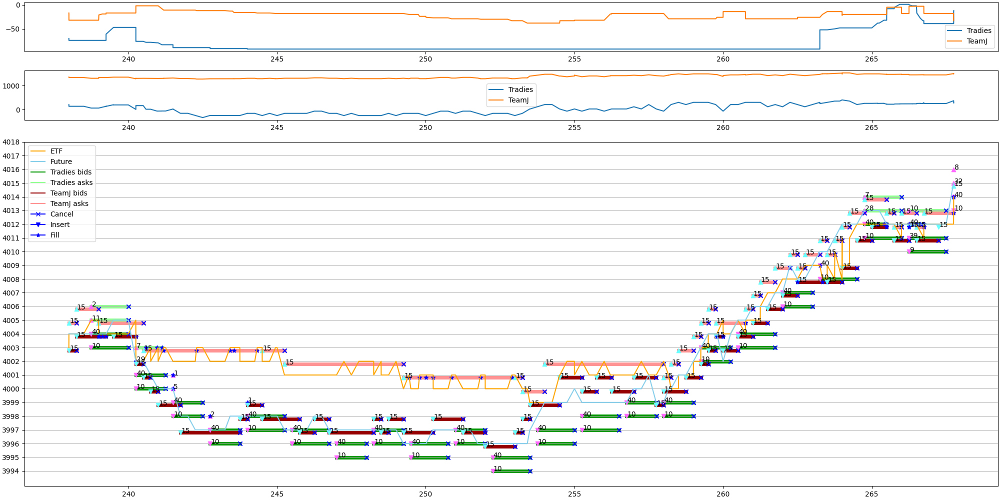

## Concave U at 338

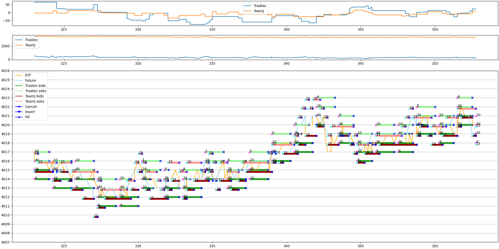

## Concave U at 602

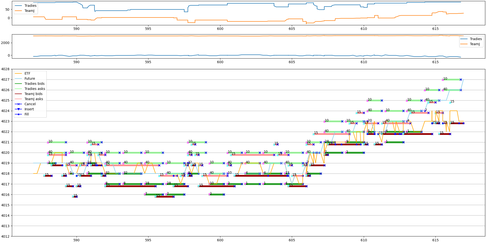

## Concave U at 1535

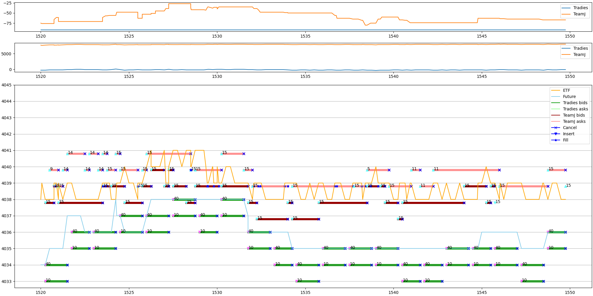

## Concave U at 1820

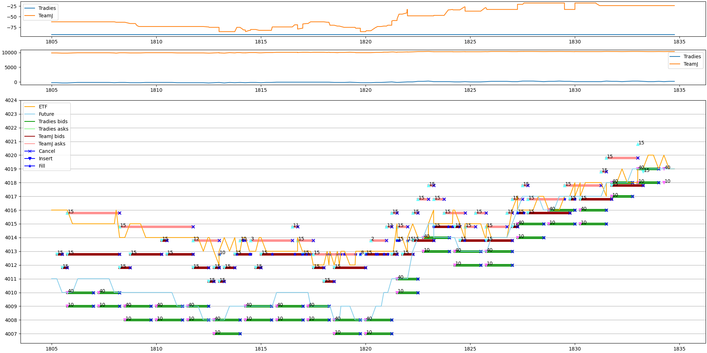

## Concave U at 196

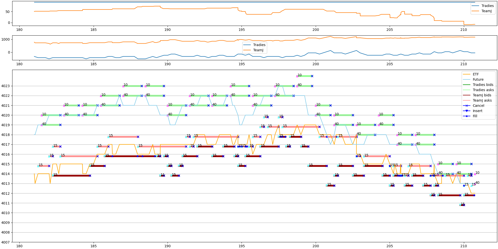
